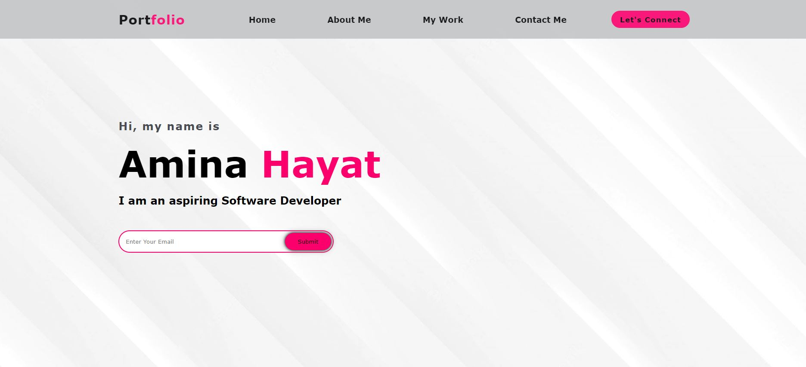
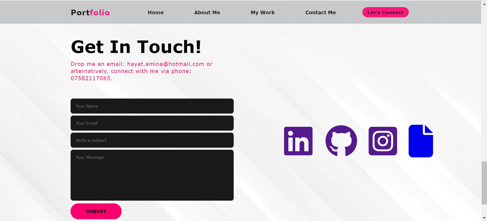
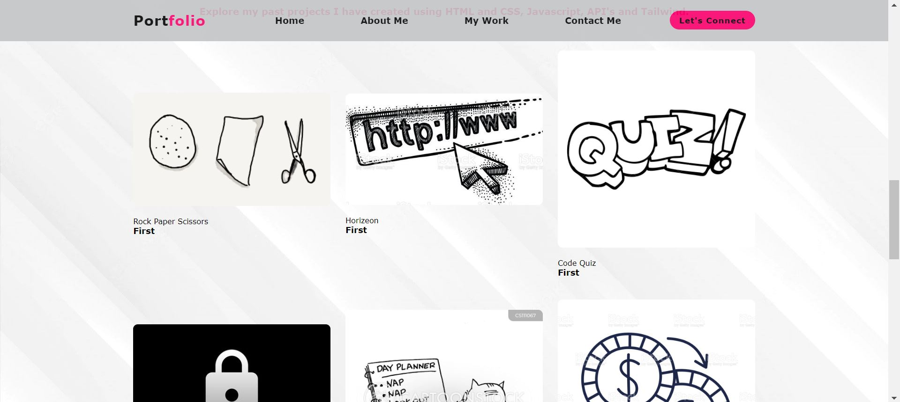

# Professional-portfolio

# ** Disclaimer **
When creating this portfolio, my liveserver (Microsoft Edge, which I have now changed to Chrome, lol) was set on zoom 67% instead of 100% unknowingly. Due to this my portfolio CSS is set to fit the screensize of 67% instead of 100% - if you are viewing this webpage in 100% zoom it will looked very zoomed in and disproportionate; please change zoom to 67% to view portfolio to it's potential. Unfortunately, this is a big mistake which I have now learnt from and will ensure to create future projects accordingly to screensize. 😔
 
 For this weeks homework, I have recreated my portfolio to ensure it looks professional, and has a polished, mobile-responsive user inerface. 
 I have also included links to my social media including, LinkedIn, GitHub and a downloadable version of my up to date CV. 

 # Technologies Used;

* HTML
* CSS
* FontAwesome

# Deployed Link
https://aminahayat.github.io/professional-portfolio/

# Github Repository Link
https://github.com/aminahayat/professional-portfolio

# Application Screenshots
 
 
 

